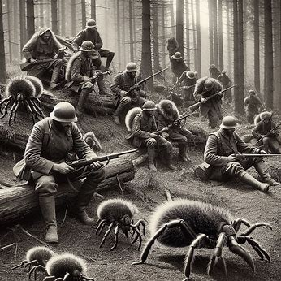
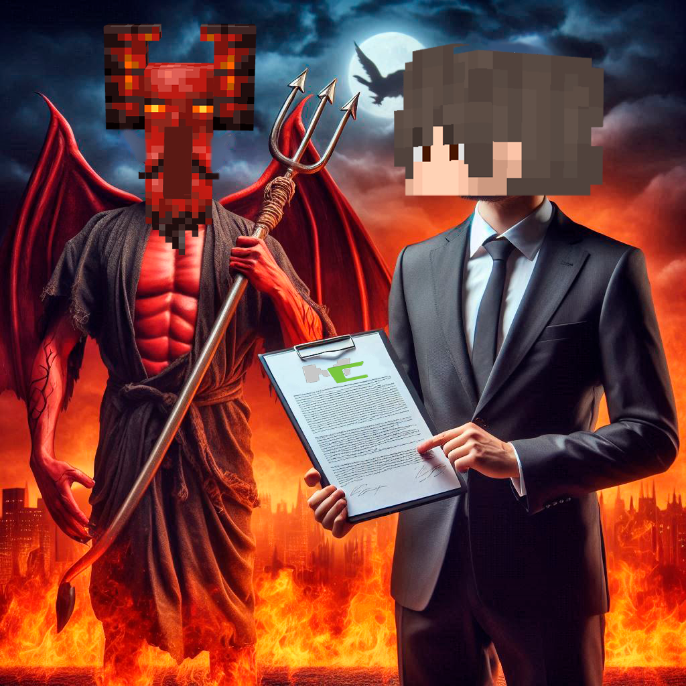
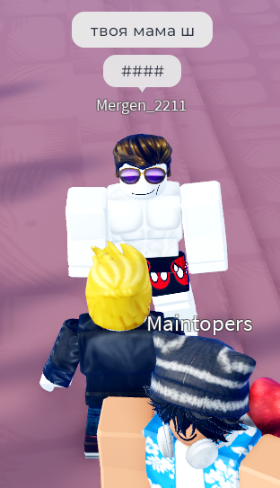
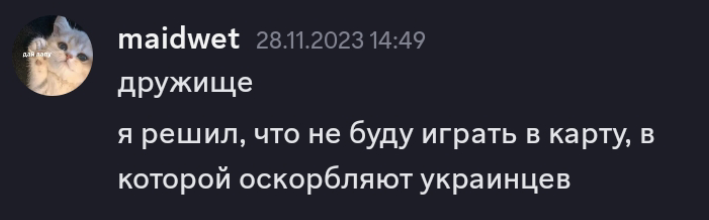
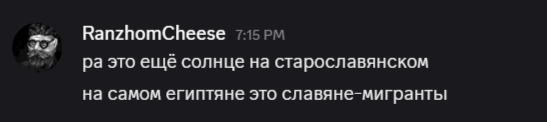

<h2 align="center">Аллея славы</h2>

  

<b>клещ сюрвайвал</b>

  

<b>многого обыкновенный</b>

  

<b>тимур Моб</b>

  

<b>твоя мама ш</b>

  

<b>варакрафт</b>

  

<b>Я хочу свою аллею славы пополнять на страничке профиля гитхаба</b>

  

<b>амбасадор фриков</b>

  

<b>конь</b>

  

<b>милликвадриордер</b>

